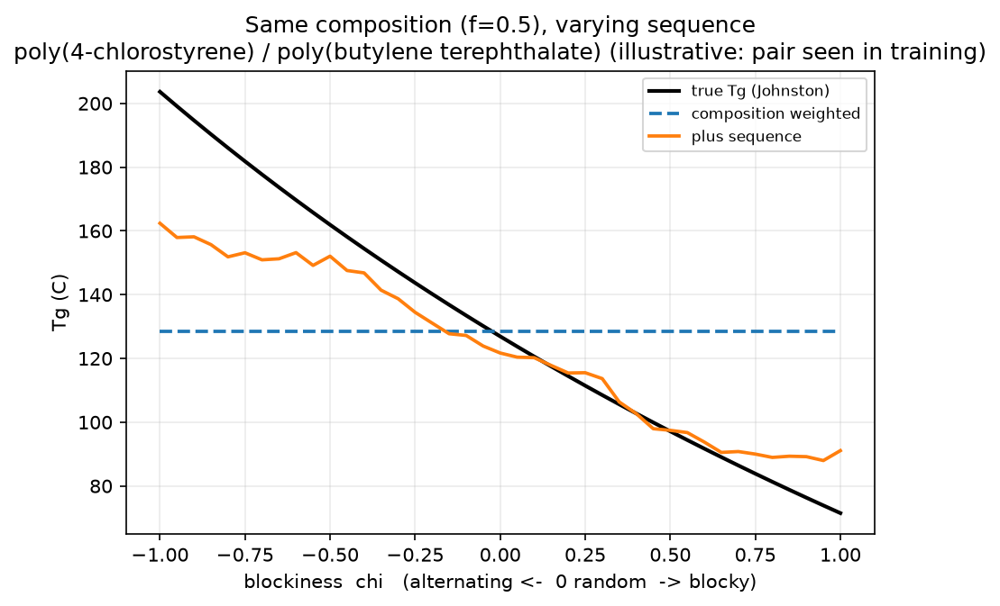
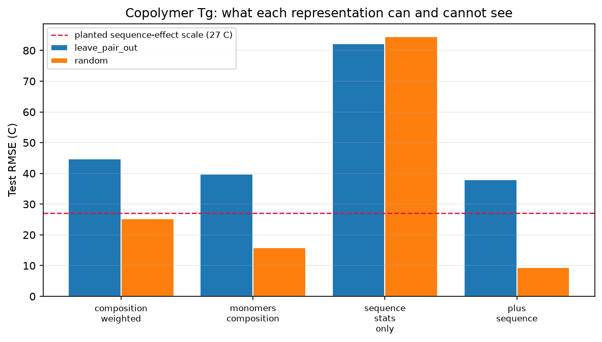

# copolybench

**When does a copolymer's *sequence* — not just its composition — matter for property prediction? A controlled benchmark that answers it.**


A copolymer is not a molecule. It is a statistical ensemble described by *composition* (how much of each comonomer) and *sequence* (how they are arranged — random, alternating, or blocky). Almost every published copolymer-property model uses composition and quietly drops sequence: it encodes a copolymer as a composition-weighted average of its comonomers' features. That encoding is, by construction, **blind to sequence** — a block and a random copolymer of identical composition map to the *identical* vector.

This repo measures exactly what that blindness costs, on ground truth where the sequence effect is known.



Same comonomers, same 50/50 composition. **Only the sequence changes.** The true glass-transition temperature moves by ~130 °C across the blockiness axis; the composition-weighted model — the field's default — returns one flat answer for all of it. (This sweep is an illustration on a pair whose other samples appear in training; the held-out evidence is the table below.)

---

## The headline result

Four representations, the same gradient-boosting model, the same splits. Only the encoding changes.

| representation | random | leave-pair-out |
|:---|---:|---:|
| composition-weighted (naive) | 25.3 | 44.8 |
| both monomers + composition | 15.8 | 39.8 |
| sequence stats only (no monomer identity) | 84.5 | 82.2 |
| **both monomers + composition + sequence** | **9.4** | **38.0** |

*Test RMSE, °C. Controlled synthetic benchmark — see below.*

Read the `random` column against the yardstick: the planted sequence effect has a standard deviation of **27 °C**, and the naive composition-weighted encoding leaves an error of the same size (**25.3 °C**) — it resolves essentially none of what sequence contributes. A sequence-blind model that at least knows the monomers does better (15.8 °C: the pair-specific sequence *sensitivity* is learnable from monomer structure, so it can anticipate the average sequence effect for a pair — though never which sequence a given sample has). Adding first-order sequence statistics — the AB dyad fraction, blockiness, mean run lengths — drops RMSE to **9.4 °C**, down toward the label-noise floor.



> 📄 **The full technical writeup** — the argument, the physics, and the nuances in article form — is in [`docs/writeup.md`](docs/writeup.md).

Two honest nuances the benchmark surfaces, both worth more than the headline number:

- **Sequence statistics alone are not enough.** Strip out monomer identity (`sequence stats only`) and error explodes to 84 °C — you need *composition, sequence, and what the comonomers are*, together.
- **The advantage shrinks out of distribution.** On `leave-pair-out` — whole comonomer pairs held out — every representation struggles (38–45 °C), because generalising the *sequence sensitivity* (which depends on the specific comonomer chemistry) to unseen pairs is genuinely hard. Sequence still helps, but the gap over the naive baseline narrows. That is a real limitation, reported, not hidden.

## Run it

```bash
git clone https://github.com/DrGregPitch/copolybench && cd copolybench
uv venv && uv pip install -e ".[dev]"      # pulls polytools from GitHub
uv run python scripts/run_ablation.py --outdir results   # ~1 min: regenerates every number and figure
```

`uv run pytest tests -v` runs the suite. The sequence/dyad engine (`sequences.py`) and the Johnston Tg oracle (`oracle.py`) are pure, tested, and documented — the physics is the interesting part.

---

## Why this is a controlled benchmark, and why that's the point

To measure which representations recover a sequence effect, you need ground truth where the sequence effect is *known*. So the labels are generated, not scraped:

- Comonomer pairs are drawn from the 60 homopolymers bundled in [`polytools`](https://github.com/DrGregPitch/polytools), each with a literature Tg.
- Each copolymer's Tg comes from the **Johnston dyad equation**, a real sequence-aware Tg model: `1/Tg = F_AA/Tg_AA + F_AB/Tg_AB + F_BB/Tg_BB`, summed over dyad fractions.
- The Johnston equation reduces *exactly* to the composition-only **Fox equation** when the AB-junction Tg equals the harmonic mean of the two homopolymer Tgs. A single per-pair parameter `delta` sets how far the junction departs from that — i.e. **how much sequence matters** — and it is a function of the comonomers' polarity mismatch, so it is learnable from structure and generalises (or fails to) on held-out pairs.

Everything about the sequence contribution is therefore known in closed form, which is what lets the benchmark make a *falsifiable* claim about each representation instead of just reporting a number. This is a measurement instrument, labelled as such — **not a Tg dataset**. Swap in real experimental copolymer data through the same record structure when you have it.

### Why not just use real data?

Because the dataset this question needs does not exist openly, and the reason is instructive. To measure sequence blindness you need copolymers where **sequence varies at fixed composition** — the same two comonomers at 50/50, made random *and* alternating *and* blocky, each with a measured property. That is rare, expensive experimental work, and no permissively-licensed dataset contains it. Public copolymer data is either composition-only or, like the block-copolymer databases, all-blocky (a single point on the sequence axis). A controlled oracle is therefore not a shortcut here; it is the only instrument that can isolate the variable in question.

The *machinery* does transfer to real data, and the sibling repos show it doing so: [`polytools`](https://github.com/DrGregPitch/polytools) runs its honest-splits benchmark on 1,077 real homopolymers (RadonPy), and [`formulate`](https://github.com/DrGregPitch/formulate) runs active learning on 6,949 real, composition-dependent polymer-electrolyte formulations (CheMixHub). This repo isolates the one axis — sequence — that real data can't yet vary on demand.

---

## The representation ladder

`copolybench.represent` implements four encodings of increasing honesty, all fed to the same model:

1. **`composition_weighted`** — `f·v_A + (1−f)·v_B`, the composition-weighted average of homopolymer features. The field default. Provably sequence-blind (there is a test asserting a block and a random copolymer of equal composition produce identical vectors).
2. **`monomers_composition`** — `[v_A, v_B, f]`. Keeps the comonomers distinct; still composition-only.
3. **`sequence_stats_only`** — composition + dyad/blockiness/run-length statistics, no monomer identity. A diagnostic.
4. **`plus_sequence`** — monomers + composition + sequence statistics. The first encoding that can see whether a chain is blocky or alternating.

---

## Limitations

- **First-order sequence only.** Dyad fractions capture nearest-neighbour statistics. Triads and longer-range order (relevant to microphase separation in real block copolymers, which can show *two* Tgs) are not modelled.
- **Controlled labels.** The sequence effect is planted with a known model, so results measure representational capacity, not agreement with experiment. The Johnston/Fox framework is a real but simplified picture of copolymer Tg.
- **Equal-unit-mass simplification** in the mixing weights; real application weights by mass fraction.
- **Out-of-distribution generalisation to novel comonomer pairs is hard** and only partly helped by sequence features — see the `leave-pair-out` column.

## Built on

The evaluation harness — structured splits, metrics, featurizers, the gradient-boosting baseline — is [`polytools`](https://github.com/DrGregPitch/polytools). This repo adds only the copolymer-specific reasoning: sequence statistics, the controlled oracle, and the representations.

## License

MIT
